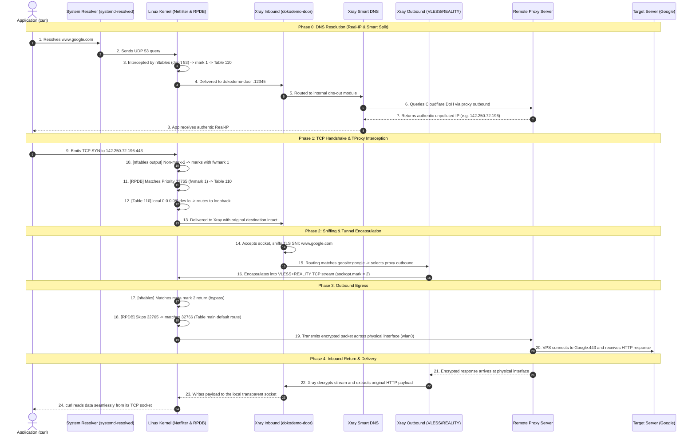

# Data Packet Lifecycle and Traffic Steering

This document explains the end-to-end journey of an application data packet through the transparent proxy system, and details the **three-tier steering and constraint architecture** used to plan, classify, and route traffic safely without loopbacks or leaks.

---

## 1. The Three-Tier Steering and Constraint Architecture

Instead of brute-force global gateway hijacking or heavy virtual TUN interfaces, this system applies a **progressive three-tier filtering and constraint model**:

```text
+-----------------------------------------------------------------------------+
| Layer 1: Kernel Netfilter (nftables)                                        |
| - Fast, coarse-grained packet marking                                       |
| - Loop prevention (mark 2 bypass)                                           |
| - DNS interception priority (port 53 before IP bypass)                      |
| - Local/LAN traffic bypass (10/8, 192.168/16, etc.)                          |
+-------------------------------------+---------------------------------------+
                                      | fwmark 1
                                      v
+-----------------------------------------------------------------------------+
| Layer 2: Kernel Policy Routing (RPDB & FIB Table 110)                       |
| - fwmark 1 matches Priority 32765 rule                                      |
| - Table 110 delivers foreign destinations to `dev lo` via `local default`   |
| - Kernel delivers packet to Xray TProxy socket without changing dst IP:port |
+-------------------------------------+---------------------------------------+
                                      | Delivered to :12345
                                      v
+-----------------------------------------------------------------------------+
| Layer 3: Application Proxy Engine (Xray Core)                               |
| - Inbound: dokodemo-door (IP_TRANSPARENT) recovers original destination     |
| - Sniffing: Extracts TLS SNI, HTTP Host, QUIC Server Name                   |
| - Smart DNS: Local resolver for portals, DoH for foreign domains            |
| - Routing: Fine-grained classification (direct / proxy / blackhole)         |
| - Outbound: Marks tunnel packets with mark 2 (preventing loops)             |
+-----------------------------------------------------------------------------+
```

### Layer 1: Kernel Netfilter Constraints (`xray-tproxy.nft`)
The `prerouting` and `output` chains enforce strict constraint ordering:
1. **Self-Loop Bypass (`meta mark 2 return`)**: Any packet originating from Xray outbounds carries `mark 2` and immediately exits the chain.
2. **ICMP Bypass (`ip protocol icmp return`)**: Native ping, traceroute, and path MTU discovery stay direct and low-latency.
3. **DNS Priority Interception (`dport 53 -> mark 1`)**: Evaluated **before** private IP bypasses. This prevents LAN gateways (e.g. `192.168.1.1:53`) from receiving unencrypted DNS queries for blocked overseas domains.
4. **LAN / Reserved IP Bypass (`ip daddr $RESERVED_IP return`)**: Non-DNS traffic to router admin portals, local NAS, SSH servers, and LAN devices stays 100% direct.
5. **Intercept Candidate Marking (`ip protocol tcp/udp -> mark 1`)**: All remaining outbound traffic is tagged with `fwmark 1`.

### Layer 2: Kernel Policy Routing Constraints (`xray-policy.conf`)
* **Priority 32765 (`fwmark 1 lookup 110`)**: Sits just above `Table main` (32766) and below `Table local` (0).
* **Table 110 (`local default dev lo`)**: Instructs the kernel that packets directed to table 110—regardless of their external destination IP—are locally destined and must be handed to loopback sockets with `IP_TRANSPARENT` enabled.

### Layer 3: Application-Level Classification (`/etc/xray/config.json`)
* **Sniffing Engine (`routeOnly: true`)**: Inspects initial handshakes to extract real domain names even when apps connect via raw IP addresses.
* **Three-Tier Smart DNS**:
  - `geosite:private`, `geosite:captive-portal`, `domain:local` -> `localhost` (system resolver / DHCP DNS).
  - `geosite:cn` -> `223.5.5.5` (Domestic fast Anycast).
  - Overseas / Blocked domains -> `https://1.1.1.1/dns-query` (Encrypted DoH via proxy tunnel).
* **Outbound Socket Marking (`sockopt.mark: 2`)**: Guarantees Layer 1 bypass for all outbound traffic.

---

## 2. End-to-End Round-Trip Lifecycle (Packet Perspective)

Consider a typical request, e.g. `curl https://www.google.com`:



---

## 3. System Invariants and Safety Guarantees

1. **Loop-Free Invariant**:
   Xray outbound sockets explicitly set `sockopt.mark: 2`. The very first rule in both nftables chains is `meta mark 2 return`. Outbound proxy streams never re-enter the proxy inbound.

2. **Zero-Leakage DNS Invariant**:
   By matching `dport 53` before `ip daddr 192.168.0.0/16 return`, DNS requests destined for local ISP routers cannot bypass the proxy. Blocked domain lookups cannot be poisoned by uplink GFW middleboxes.

3. **Clean Route Table Invariant**:
   `Table main` remains completely untouched. The default gateway is never overwritten. If `xray-tproxy.service` is stopped, `ExecStopPost` flushes Table 110 and removes nftables tables, restoring direct networking in milliseconds.

4. **Zero-Stale-Socket Invariant**:
   All outbounds configure `tcpKeepAliveIdle: 15` and `tcpKeepAliveInterval: 5`. When waking from sleep or roaming between Wi-Fi networks, dead TCP connections are detected and purged within 20 seconds.
